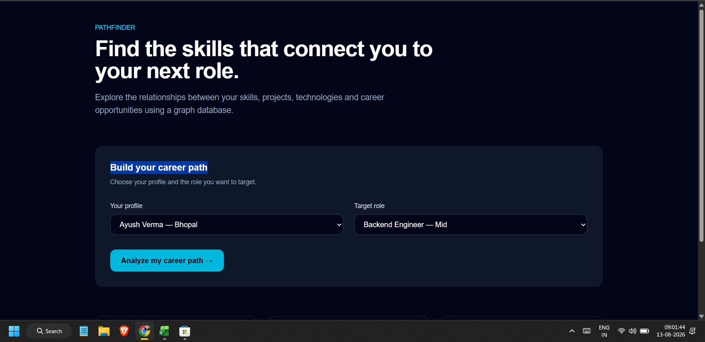
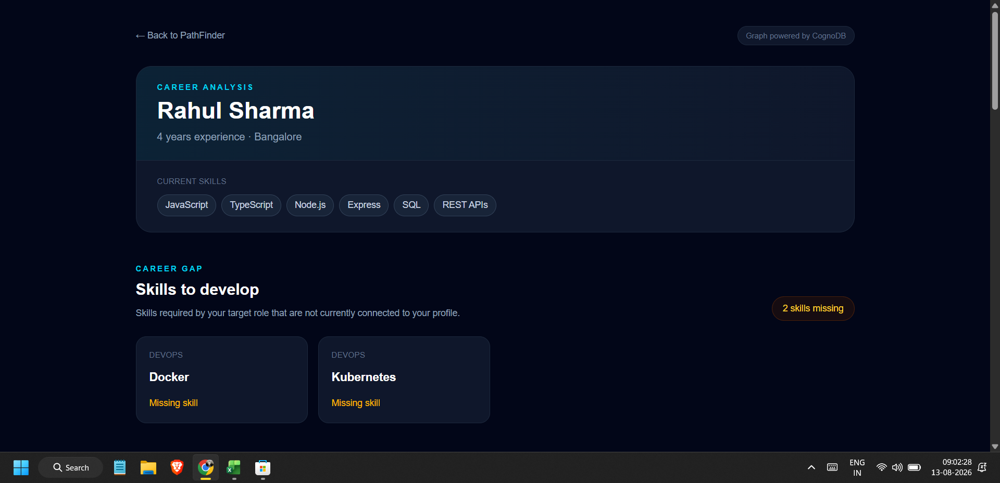
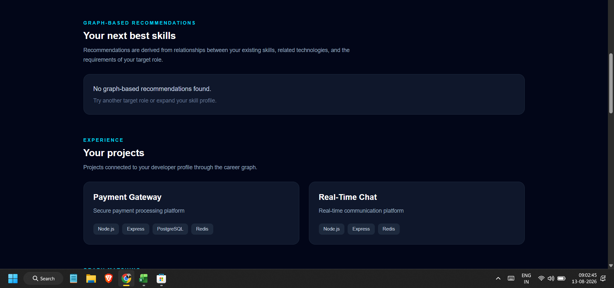
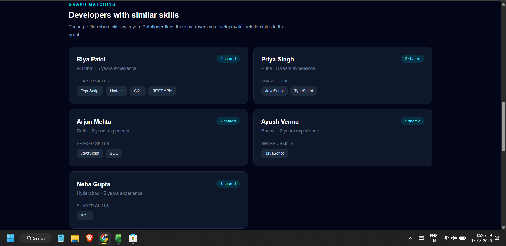
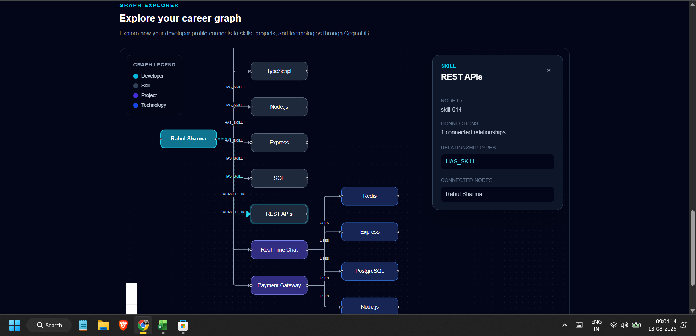
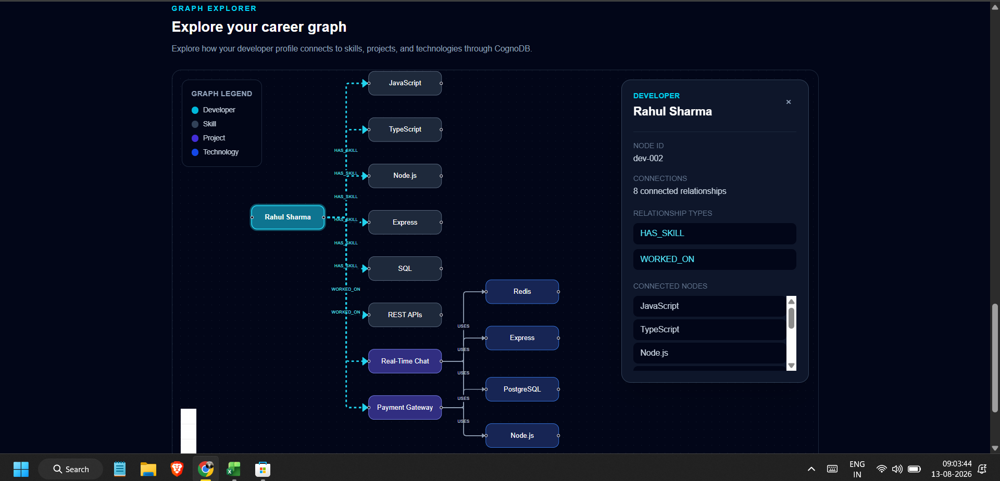

Yes. Your current README has **good content**, but it is too repetitive and the hierarchy is inconsistent. For this assignment, I would make it much more focused on the evaluator's checklist:

1. What is PathFinder?
2. Why graph database?
3. Data model + diagram
4. Architecture
5. Features/use case
6. Main Cypher queries
7. Setup/CognoDB configuration
8. Project structure
9. Screenshots
10. Deployment
11. Security/engineering notes

I would **remove the repeated explanations** of the same graph traversals and avoid claiming anything not actually demonstrated.

Below is the **complete final README**. You can replace your entire `README.md` with this.


````markdown
# PathFinder

## Developer Career Intelligence Using Graph Databases

PathFinder is a graph-based career intelligence application that helps developers understand their current technical profile, identify missing skills for a target role, discover developers with similar skills, and explore connections between skills, projects, technologies, and jobs.

The application is backed by **CognoDB**, a managed graph database, and communicates with it using the official **Neo4j JavaScript driver** over the Bolt protocol.

---

## Live Demo

**Hosted Application:**  
https://pathfinder-nine-sigma.vercel.app

**GitHub Repository:**  
https://github.com/averma1998/pathfinder

---

# Features

- Developer profile analysis
- Target-role skill gap analysis
- Graph-based skill recommendations
- Similar developer discovery
- Interactive career graph visualization
- Interactive graph node inspection
- Developer → Skill relationships
- Developer → Project relationships
- Project → Technology relationships
- Job → Skill relationships
- Skill → Skill relationships
- Multi-hop graph traversal
- Parameterized Cypher queries
- Realistic seed data
- Loading states
- Empty states
- Error handling
- Hosted deployment using Vercel

---

# Why a Graph Database?

PathFinder is designed around questions where **relationships between entities are more important than individual records**.

For example:

- Which developers have skills similar to me?
- Which skills am I missing for a target role?
- Which projects demonstrate my technical experience?
- Which technologies are connected to my projects?
- Which skills are related to skills I already know?
- Which developers share multiple skills with me?
- Which skills should I learn next for a particular role?

These questions naturally involve traversing relationships across multiple entities.

A relational database could represent the same information using tables such as:

```text
Developers
DeveloperSkills
Skills
Projects
ProjectTechnologies
Technologies
Jobs
JobSkills
SkillRelationships
````

However, relationship-heavy queries would require multiple joins across these tables.

PathFinder instead represents the relationships directly:

```text
Developer
    |
    | HAS_SKILL
    v
  Skill
    |
    | RELATED_TO
    v
  Skill
```

```text
Developer
    |
    | WORKED_ON
    v
  Project
    |
    | USES
    v
Technology
```

```text
Job
    |
    | REQUIRES
    v
  Skill
```

This makes graph traversal a natural way to answer the application's core questions.

---

# Graph Data Model

PathFinder uses five primary node types:

* `Developer`
* `Skill`
* `Project`
* `Technology`
* `Job`

## Relationships

```text
(Developer)-[:HAS_SKILL]->(Skill)

(Developer)-[:WORKED_ON]->(Project)

(Project)-[:USES]->(Technology)

(Job)-[:REQUIRES]->(Skill)

(Skill)-[:RELATED_TO]->(Skill)
```

## Graph Overview

```text
                         +-------------+
                         |     Job     |
                         +------+------+
                                |
                             REQUIRES
                                |
                                v
                         +-------------+
                         |    Skill    |
                         +------+------+
                                ^
                                |
                            HAS_SKILL
                                |
                         +------+------+
                         |  Developer  |
                         +------+------+
                                |
                            WORKED_ON
                                |
                                v
                         +-------------+
                         |   Project   |
                         +------+------+
                                |
                               USES
                                |
                                v
                         +-------------+
                         | Technology  |
                         +-------------+

Skill ---------------- RELATED_TO ----------------> Skill
```

A more detailed description of the data model is available in:

`docs/graph-data-model.md`

---

# Node Types

## Developer

Represents a developer profile.

Example properties:

```text
id
name
experience
location
```

Example:

```cypher
(:Developer {
    id: "dev-001",
    name: "Developer Name",
    experience: 2,
    location: "Bhopal"
})
```

## Skill

Represents a technical skill possessed by a developer or required by a job.

Example properties:

```text
id
name
category
```

## Project

Represents a project associated with a developer.

Example properties:

```text
id
name
description
```

## Technology

Represents a technology used by a project.

Example properties:

```text
id
name
category
```

## Job

Represents a target career role.

Example properties:

```text
id
title
```

---

# Relationship Types

## HAS_SKILL

Connects a developer with a skill.

```cypher
(Developer)-[:HAS_SKILL]->(Skill)
```

Example:

```text
Developer → HAS_SKILL → JavaScript
```

## WORKED_ON

Connects a developer with a project.

```cypher
(Developer)-[:WORKED_ON]->(Project)
```

## USES

Connects a project with a technology.

```cypher
(Project)-[:USES]->(Technology)
```

## REQUIRES

Connects a job with a required skill.

```cypher
(Job)-[:REQUIRES]->(Skill)
```

## RELATED_TO

Connects related technical skills.

```cypher
(Skill)-[:RELATED_TO]->(Skill)
```

This relationship allows PathFinder to discover potential next skills based on a developer's existing skills.

---

# Multi-Hop Graph Traversal

A key part of PathFinder is using multiple relationships to derive career insights.

## Skill Recommendation

The recommendation flow can traverse:

```text
Developer
    |
    | HAS_SKILL
    v
Current Skill
    |
    | RELATED_TO
    v
Recommended Skill
    ^
    |
    | REQUIRES
    |
Target Job
```

This allows the application to find skills that are related to what a developer already knows while also being relevant to the target role.

## Similar Developers

Similar developers are identified through shared skill relationships:

```text
Developer A
    |
    | HAS_SKILL
    v
  Skill
    ^
    | HAS_SKILL
    |
Developer B
```

Developers can then be ranked according to the number of shared skills.

These multi-hop traversals are one of the main reasons a graph database is appropriate for PathFinder.

---

# Application Architecture

```text
                    +----------------------+
                    |       Browser        |
                    |   Next.js Frontend   |
                    +----------+-----------+
                               |
                              HTTP
                               |
                               v
                    +----------------------+
                    |     Next.js API      |
                    |       Routes         |
                    +----------+-----------+
                               |
                             Cypher
                               |
                               v
                    +----------------------+
                    |  Neo4j JavaScript    |
                    |       Driver         |
                    +----------+-----------+
                               |
                              Bolt
                               |
                               v
                    +----------------------+
                    |       CognoDB        |
                    |    Graph Database    |
                    +----------------------+
```

The application follows a simple flow:

```text
Browser
   ↓
Next.js UI
   ↓
Next.js API Route
   ↓
Graph Query
   ↓
Neo4j JavaScript Driver
   ↓
CognoDB
   ↓
Cypher Result
   ↓
API Response
   ↓
UI
```

---

# Technology Stack

## Frontend

* Next.js
* React
* TypeScript
* Tailwind CSS
* React Flow

## Backend

* Next.js App Router
* Next.js API Routes
* TypeScript
* Neo4j JavaScript Driver

## Database

* CognoDB
* openCypher
* Bolt protocol

## Development & Deployment

* Node.js
* npm
* Git
* GitHub
* Vercel

---

# Application Workflow

A typical PathFinder workflow is:

```text
                    PathFinder
                        |
                        v
                Select Developer
                        |
                        v
                 Select Target Job
                        |
                        v
                 Career Analysis
                        |
              +---------+---------+
              |                   |
              v                   v
        Missing Skills     Recommendations
              |                   |
              +---------+---------+
                        |
                        v
                Similar Developers
                        |
                        v
                Interactive Graph
```

---

# Core Application Features

## 1. Developer Profile

The application displays a developer's:

* Name
* Experience
* Location
* Current technical skills

The information is retrieved from the graph database.

---

## 2. Career Gap Analysis

PathFinder compares the developer's current skills with the skills required by a target role.

Conceptually:

```text
Developer's Current Skills
            |
            | compare
            v
Target Job's Required Skills
            |
            v
      Missing Skills
```

For example, if a target backend role requires:

```text
JavaScript
Node.js
Express
REST APIs
SQL
```

and the developer only has:

```text
JavaScript
React
Next.js
```

PathFinder identifies the missing backend skills.

---

## 3. Skill Recommendations

PathFinder recommends skills that can be useful next steps based on:

* Existing developer skills
* Related skills
* Target job requirements

The graph traversal is:

```text
Developer
    |
    | HAS_SKILL
    v
Current Skill
    |
    | RELATED_TO
    v
Recommended Skill
    ^
    |
    | REQUIRES
    |
Target Job
```

---

## 4. Similar Developers

PathFinder finds developers who share skills with the selected developer.

For example:

```text
Developer A
    |
    +---- JavaScript
    +---- React
    +---- Next.js


Developer B
    |
    +---- JavaScript
    +---- React
    +---- Next.js
```

The application displays:

* Developer name
* Location
* Experience
* Shared skills
* Number of shared skills

---

## 5. Interactive Career Graph

The graph explorer visualizes the developer's connected career information using React Flow.

Example:

```text
Developer
    |
    +---- Skills
    |
    +---- Projects
             |
             +---- Technologies
```

Users can:

* Pan around the graph
* Zoom in and out
* Drag nodes
* Select nodes
* Inspect node information
* View relationships
* Explore connected entities

---

# Cypher Queries

The repository contains the main Cypher queries used by the application:

```text
queries/
├── career-path.cypher
├── similar-developers.cypher
├── graph-explorer.cypher
├── recommendations.cypher
└── README.md
```

---

## Career Path Query

File:

```text
queries/career-path.cypher
```

### Purpose

Find skills required by a target job that are not currently connected to the developer.

The query compares:

```text
Target Job
    |
    | REQUIRES
    v
Required Skills
```

against:

```text
Developer
    |
    | HAS_SKILL
    v
Current Skills
```

The difference produces the missing skills.

---

## Similar Developers Query

File:

```text
queries/similar-developers.cypher
```

### Purpose

Find developers who share skills with the selected developer.

Traversal:

```text
Developer A
    |
    | HAS_SKILL
    v
  Skill
    ^
    | HAS_SKILL
    |
Developer B
```

The results include the shared skills and shared skill count.

---

## Graph Explorer Query

File:

```text
queries/graph-explorer.cypher
```

### Purpose

Retrieve the connected career graph for a developer.

The graph includes:

```text
Developer
    |
    +---- Skill
    |
    +---- Project
             |
             +---- Technology
```

The API transforms the graph data into nodes and relationships consumed by the React Flow visualization.

---

## Recommendations Query

File:

```text
queries/recommendations.cypher
```

### Purpose

Recommend skills connected to the developer's current skills and relevant to the target job.

Traversal:

```text
Developer
    |
    | HAS_SKILL
    v
Current Skill
    |
    | RELATED_TO
    v
Recommended Skill
    ^
    |
    | REQUIRES
    |
Target Job
```

---

# Parameterized Cypher

PathFinder uses parameterized Cypher queries through the official Neo4j JavaScript driver.

Example:

```typescript
const result = await session.run(
  `
  MATCH (d:Developer {id: $developerId})
  RETURN d
  `,
  {
    developerId,
  }
);
```

User-controlled values are passed as parameters instead of being concatenated into Cypher strings.

This provides:

* Safer database interaction
* Cleaner query code
* Better query maintainability
* Separation between query structure and input values

---

# Seed Data

Realistic sample data is included in the repository.

The seed script is:

```text
scripts/seed.ts
```

It creates sample:

* Developers
* Skills
* Projects
* Technologies
* Jobs
* Graph relationships

The dataset is intentionally kept small enough to run comfortably on the CognoDB free tier while still demonstrating meaningful graph traversal.

---

# API Routes

The application exposes the following API routes:

```text
/api/health

/api/developers

/api/developers/[id]

/api/developers/[id]/projects

/api/developers/[id]/similar

/api/jobs

/api/career-path

/api/recommendations

/api/graph
```

These routes provide the frontend with developer data, project data, career analysis, recommendations, similar developers, and graph information.

---

# Project Structure

```text
pathfinder/
│
├── app/
│   ├── api/
│   │   ├── career-path/
│   │   ├── developers/
│   │   │   └── [id]/
│   │   ├── graph/
│   │   ├── health/
│   │   ├── jobs/
│   │   └── recommendations/
│   │
│   ├── career-path/
│   │   └── page.tsx
│   │
│   ├── layout.tsx
│   ├── page.tsx
│   └── global.css
│
├── components/
│   ├── CareerAnalysis.tsx
│   ├── CareerPath.tsx
│   ├── DeveloperProfile.tsx
│   ├── DeveloperSearch.tsx
│   ├── DeveloperSelector.tsx
│   ├── GraphView.tsx
│   ├── JobSelector.tsx
│   ├── LoadingState.tsx
│   ├── ProjectCard.tsx
│   ├── RecommendationCard.tsx
│   ├── SimilarDevelopers.tsx
│   └── SkillCard.tsx
│
├── lib/
│   ├── cognodb.ts
│   └── queries.ts
│
├── scripts/
│   └── seed.ts
│
├── queries/
│   ├── career-path.cypher
│   ├── graph-explorer.cypher
│   ├── recommendations.cypher
│   ├── similar-developers.cypher
│   └── README.md
│
├── docs/
│   ├── graph-data-model.md
│   └── screenshots/
│       ├── homepage.png
│       ├── career_analysis.png
│       ├── recommendations.png
│       ├── similar_developers.png
│       ├── graph_explorer.png
│       └── graph_explorer_nodes.png
│
├── public/
│
├── .env.example
├── .gitignore
├── package.json
├── package-lock.json
├── tsconfig.json
└── README.md
```

---

# Getting Started

## Prerequisites

Install:

* Node.js 20 or later
* npm
* Git

You also need a CognoDB Cloud account and a CognoDB instance.

---

# CognoDB Setup

## 1. Create an Account

Create a CognoDB account:

[https://console.cognodb.com/signup](https://console.cognodb.com/signup)

---

## 2. Create a Free Instance

From the CognoDB console:

1. Create a new database instance.
2. Select the free `c0` tier.
3. Select a region.
4. Wait for the instance to provision.

---

## 3. Save Connection Details

CognoDB provides a connection URI similar to:

```text
bolt+s://<instance-id>.databases.cognodb.cloud
```

The username is:

```text
cognodb
```

Save the generated password when the instance is created.

---

# Environment Variables

Create a local environment file:

```text
.env.local
```

Add:

```env
COGNODB_URI=bolt+s://your-instance-id.databases.cognodb.cloud
COGNODB_USERNAME=cognodb
COGNODB_PASSWORD=your-password
```

The repository contains:

```text
.env.example
```

as a safe configuration template.

Example:

```env
COGNODB_URI=
COGNODB_USERNAME=cognodb
COGNODB_PASSWORD=
```

**Never commit `.env.local` or database credentials to GitHub.**

---

# Installation

Clone the repository:

```bash
git clone https://github.com/averma1998/pathfinder.git
cd pathfinder
```

Install dependencies:

```bash
npm install
```

---

# Seed the Database

After configuring `.env.local`, run:

```bash
npm run seed
```

The seed script connects to CognoDB and creates the sample graph data.

---

# Run the Application

Start the development server:

```bash
npm run dev
```

Open:

```text
http://localhost:3000
```

---

# Production Build

Verify the production build:

```bash
npm run build
```

Start the production server:

```bash
npm start
```

---

# Error Handling

PathFinder handles common application states gracefully.

### Loading State

Loading indicators are displayed while API and graph data are being retrieved.

### Empty State

If graph data or other application data is unavailable, the UI displays an appropriate empty-state message.

### Error State

If an API request or database request fails, the application displays a user-friendly error message instead of exposing raw database errors.

---

# Security

Database credentials are loaded through environment variables.

The following practices are used:

* CognoDB credentials are not stored in source code.
* `.env.local` is excluded through `.gitignore`.
* `.env.example` contains only placeholder values.
* Cypher queries use parameters rather than string concatenation.
* Database access is centralized through the application database layer.

---

# Screenshots

## 1. PathFinder Homepage

The homepage allows users to select a developer profile and a target career role.



---

## 2. Career Analysis

The career analysis view displays the developer profile and identifies skills that are missing for the selected target role.



---

## 3. Graph-Based Recommendations

PathFinder provides graph-based recommendations for skills that can help the developer progress toward the selected target role.



---

## 4. Similar Developers

The application identifies developers who share skills with the selected developer.



---

## 5. Interactive Career Graph

The graph explorer visualizes the developer's relationships with skills, projects, and technologies.



---

## 6. Graph Node Inspection

Users can select a graph node to inspect its node ID, relationship types, and connected nodes.



---

# Deployment

PathFinder is deployed using Vercel.

**Live Demo:**

[https://pathfinder-nine-sigma.vercel.app](https://pathfinder-nine-sigma.vercel.app)

The deployed application connects to CognoDB using environment variables configured in the Vercel project.

The production deployment was verified using the Next.js production build:

```bash
npm run build
```


# Conclusion

PathFinder demonstrates how a graph database can be used to build a career intelligence application where relationships between developers, skills, projects, technologies, and jobs are central to the application's functionality.

The project combines:

* Graph data modeling
* openCypher queries
* Neo4j JavaScript Driver
* CognoDB
* Next.js
* TypeScript
* React Flow
* Parameterized database access
* Interactive graph visualization

The goal is to provide a practical example of using graph traversal to generate career-related insights rather than treating the underlying data as independent records.

````
